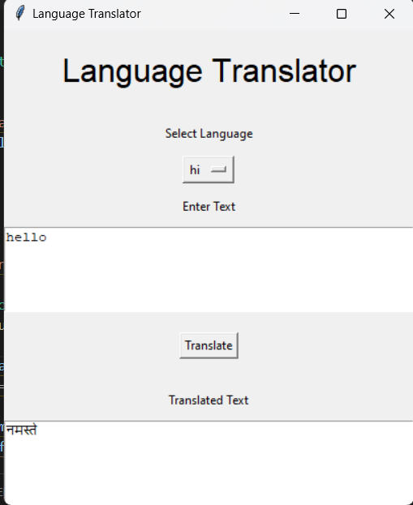

# Language Translator

A simple GUI-based application that allows users to translate text to different languages using the `googletrans` library.

## Details

This application utilizes the following Python libraries:
- `tkinter` for the GUI.
- `googletrans` for translation functionality.
- `json` for loading available languages.

### Prerequisites

The following Python packages need to be installed:

- tkinter: Comes pre-installed with most Python installations.
- googletrans: `pip install googletrans==4.0.0-rc1`

## Features

- User-friendly interface.
- Ability to choose from a dropdown of languages.
- Displays both the input and the translated text.

## Getting Started

1. Clone the repository: git clone https://github.com/Bisalkumar/Translator.git
2. Navigate to the project directory: cd path/to/directory
3. Install the required packages: pip install googletrans==4.0.0-rc1
4. Run the application: pyton Translator.py

## How to Use
1. Select the desired language from the dropdown.
2. Enter the text you want to translate in the input box.
3. Click on the "Translate" button.
4. The translated text will appear in the output box.

## Screenshots

## Contributions
Contributions are always welcome! Please read the contribution guidelines first.

## License
This project is licensed under the MIT License. See the LICENSE file for details.

## Acknowledgement
Thanks to the developers of the googletrans library for making translations easy.